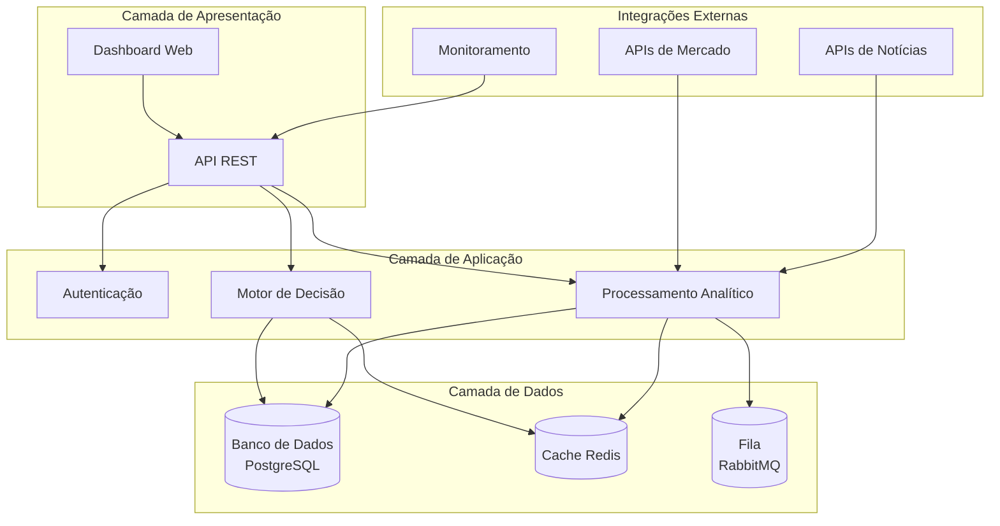
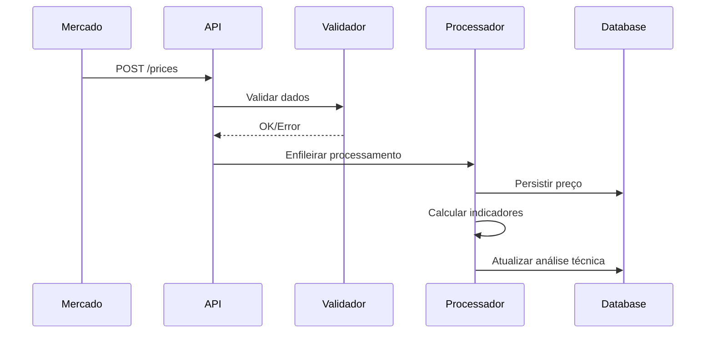
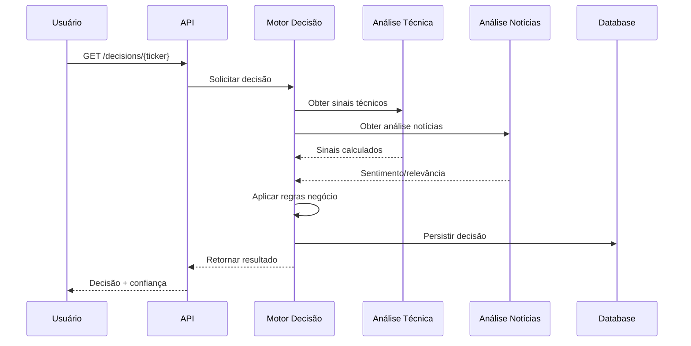

# 🏗️ Arquitetura do Sistema

## Visão Geral da Arquitetura

A plataforma segue uma arquitetura **modular e orientada a eventos**, projetada para alta disponibilidade, escalabilidade e manutenibilidade.



## Componentes Principais

### 🎯 Motor de Decisão
**Responsabilidades:**
- Combinação de sinais técnicos e informacionais
- Aplicação de regras de negócio
- Geração de recomendações com confiança

**Tecnologias:**
- Python + FastAPI
- Algoritmos de ML (Scikit-learn)
- Regras baseadas em lógica fuzzy

### 📊 Processamento Analítico
**Módulos:**
- **Análise Técnica**: Cálculo de indicadores (SMA, RSI, etc.)
- **Análise de Notícias**: NLP para sentimento e relevância
- **Validação de Dados**: Regras de consistência

**Tecnologias:**
- Python + Pandas/NumPy
- spaCy/NLTK para NLP
- Apache Spark (futuro)

### 🌐 API REST
**Endpoints Principais:**
- `/prices` - Ingestão de preços
- `/news` - Ingestão de notícias
- `/decisions` - Consulta de decisões
- `/assets` - Gestão de ativos

**Características:**
- OpenAPI 3.0 documentation
- Rate limiting
- Autenticação JWT

### 💾 Armazenamento de Dados

#### Banco Principal (PostgreSQL)
```sql
-- Estrutura simplificada
CREATE TABLE assets (
    ticker VARCHAR PRIMARY KEY,
    name VARCHAR NOT NULL,
    market VARCHAR NOT NULL,
    status VARCHAR DEFAULT 'active'
);

CREATE TABLE prices (
    id SERIAL PRIMARY KEY,
    ticker VARCHAR REFERENCES assets(ticker),
    price DECIMAL NOT NULL,
    volume BIGINT,
    timestamp TIMESTAMP DEFAULT NOW()
);

CREATE TABLE news (
    id SERIAL PRIMARY KEY,
    title TEXT NOT NULL,
    content TEXT,
    sentiment VARCHAR,
    relevance VARCHAR,
    published_at TIMESTAMP
);

CREATE TABLE decisions (
    id SERIAL PRIMARY KEY,
    ticker VARCHAR REFERENCES assets(ticker),
    action VARCHAR NOT NULL, -- buy/sell/hold
    confidence DECIMAL,
    justification TEXT,
    created_at TIMESTAMP DEFAULT NOW()
);
```

#### Cache (Redis)
- Sessões de usuário
- Resultados de cálculos recentes
- Configurações dinâmicas

#### Fila de Mensagens (RabbitMQ)
- Processamento assíncrono de notícias
- Reprocessamento em lote
- Notificações

## Fluxos de Dados

### 🔄 Fluxo de Ingestão



### 🤖 Fluxo de Decisão



## Tecnologias Utilizadas

### Backend
- **Python 3.11+**: Linguagem principal
- **FastAPI**: Framework web assíncrono
- **SQLAlchemy**: ORM para banco de dados
- **Pydantic**: Validação de dados

### Frontend
- **React/TypeScript**: Interface moderna
- **Material-UI**: Componentes consistentes
- **Chart.js/D3.js**: Visualização de dados

### Infraestrutura
- **Docker**: Containerização
- **PostgreSQL**: Banco relacional
- **Redis**: Cache e sessões
- **RabbitMQ**: Mensageria
- **Nginx**: Proxy reverso

### DevOps
- **GitHub Actions**: CI/CD
- **Docker Compose**: Ambiente local
- **Prometheus/Grafana**: Monitoramento
- **ELK Stack**: Logs e análise

## Padrões Arquiteturais

### 🧱 Clean Architecture
- **Camada de Domínio**: Regras de negócio puras
- **Camada de Aplicação**: Casos de uso
- **Camada de Infraestrutura**: Detalhes técnicos
- **Camada de Apresentação**: Interfaces externas

### 🎯 CQRS + Event Sourcing
- **Commands**: Modificações de estado
- **Queries**: Consultas de dados
- **Events**: Rastreamento de mudanças

### 🔌 Microserviços
- **Decomposição por domínio**: Serviços especializados
- **Comunicação assíncrona**: Via eventos
- **APIs independentes**: Contratos claros

## Segurança

### 🔐 Autenticação e Autorização
- JWT para sessões
- OAuth 2.0 para integrações
- RBAC (Role-Based Access Control)

### 🛡️ Proteções
- Rate limiting
- Input validation
- SQL injection prevention
- XSS protection

### 🔒 Dados Sensíveis
- Criptografia em trânsito (TLS 1.3)
- Hashing de senhas (bcrypt)
- Máscara de dados em logs

## Escalabilidade

### Horizontal
- Load balancing com Nginx
- Auto-scaling baseado em métricas
- Database read replicas

### Vertical
- Otimização de queries
- Cache inteligente
- Compressão de respostas

## Monitoramento

### Métricas
- Latência de resposta
- Taxa de erro
- Throughput
- Utilização de recursos

### Alertas
- Disponibilidade do sistema
- Performance degradada
- Erros críticos

### Logs
- Estruturados (JSON)
- Centralizados (ELK)
- Rastreáveis por request