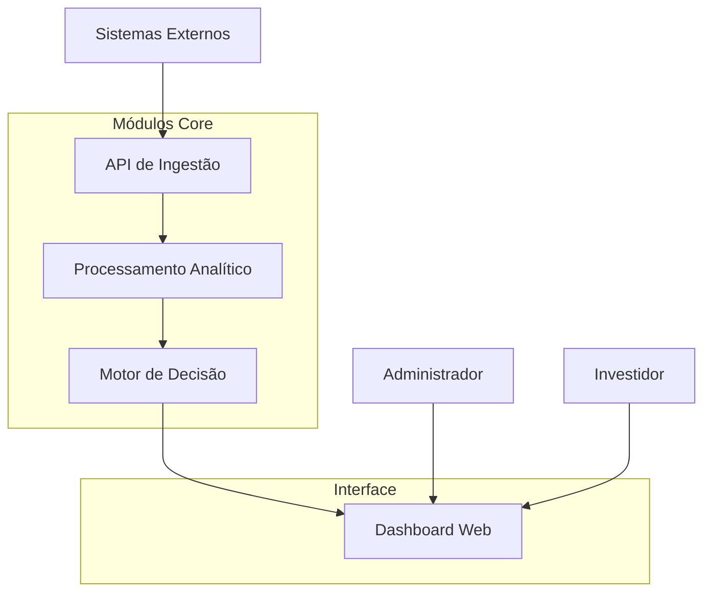

# 🏛️ Plataforma Analítica em Tempo Real para Mercado Financeiro

!!! info "Sistema de Recomendação Automatizada"
    Uma plataforma inteligente que combina análise técnica, processamento de notícias e IA para gerar recomendações de investimento em tempo real.

## 📊 O que este sistema faz

A **Plataforma Analítica em Tempo Real** monitora ativos financeiros, processa dados de mercado e notícias, aplicando algoritmos de IA para gerar recomendações automatizadas de **compra**, **venda** ou **manutenção** de posições.

### Funcionalidades Principais

- 📈 **Monitoramento em Tempo Real**: Acompanhamento contínuo de preços e volumes
- 📰 **Análise de Notícias**: Classificação automática de sentimento e relevância
- 🤖 **Decisões Inteligentes**: Recomendações baseadas em análise técnica + informacional
- 📊 **Dashboard Interativo**: Visualização completa do estado dos ativos
- 🔧 **Administração Completa**: Gestão de ativos, parâmetros e auditoria

## 🏗️ Arquitetura do Sistema

## 📋 Seções da Documentação

| Seção | Descrição |
|---|---|
| [**Visão Geral**](visao-geral.md) | Objetivo, problema e escopo do sistema |
| [**Arquitetura**](arquitetura.md) | Componentes, tecnologias e fluxos |
| [**Requisitos**](requisitos.md) | Requisitos funcionais e não funcionais |
| [**User Stories**](user-stories.md) | Backlog orientado ao usuário |
| [**Casos de Uso**](casos-de-uso.md) | Interações detalhadas do sistema |
| [**Diagramas**](diagramas.md) | Diagramas UML e de arquitetura |

## 🚀 Começando

Para entender melhor o sistema, recomendamos seguir esta ordem de leitura:

1. **Visão Geral** - Entenda o propósito e valor do sistema
2. **Arquitetura** - Veja como tudo se conecta
3. **Requisitos** - Conheça as funcionalidades detalhadas
4. **User Stories** - Perspectiva do usuário final
5. **Diagramas** - Visualizações técnicas

## 📞 Suporte

Para dúvidas sobre o projeto ou contribuições, consulte a documentação técnica ou abra uma issue no repositório.

---

!!! tip "💡 Dica"
    Use a busca integrada (tecla `/`) para encontrar rapidamente qualquer informação nesta documentação.